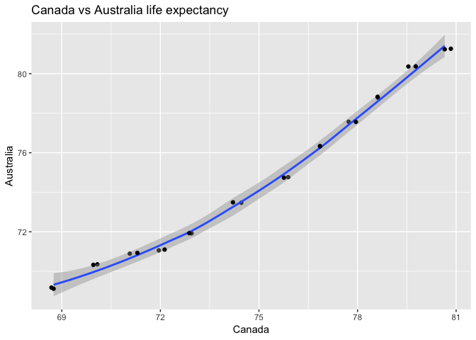

KZ\_HW04
================

-   [Task \#1](#task-1)
    -   [Activity 2:](#activity-2)

Welcome to my 4th homework assignment. In this assignment I will complete two tasks. For my first task I will change the shape of my data and for the second I will combine two data sources into one data object.

Task \#1
========

Activity 2:
-----------

Make a tibble with one row per year and columns for life expectancy for two or more countries. Use knitr::kable() to make this table look pretty in your rendered homework. Take advantage of this new data shape to scatterplot life expectancy for one country against that of another.

For this assignment I will use the **gapminder** dataset. I will begin by loading the dataset as well as packages I will be using (such as the knitr package to use the kable function)

``` r
suppressPackageStartupMessages(library(gapminder))
suppressPackageStartupMessages(library(tidyverse))
suppressPackageStartupMessages(library(knitr))
suppressPackageStartupMessages(library(kableExtra))
```

For this task I plan to use the *gather* and *spread* functions. Before I begin let's talk about what these functions are.

**Gather** -&gt; takes multiple columns and gather them into key-value pairs (makes wide data longer OR making untidy data tidy)

**Spread** -&gt; takes a key-valye pair and spreads them into multiple columns (makes long data wider OR making tidy data untidy to please the eye)

Tyler Rinker has a great guide for spread and gather functions at this [link](https://github.com/trinker/tidyr_in_a_nutshell/blob/master/README.md)

Remember: From previous exercises, we can also use the **select** function to choose certain columns and **filter** function to select certain rows.

``` r
#our first step is to create a tibble with one row per year and columns for life expectancy for two or more countries.

#Gapminder is already a tibble but we are going to create changes to it so we will rename it as a new tibble

#this new tibble will be called *new_gap*

new_gap <- gapminder %>%
  filter(country %in% c('Canada', 'Australia', 'New Zealand')) %>%
          select(country, year, lifeExp) %>% #Now I have created a new tibble for New Zealand and Canada's life expectancy. 
# My Next move is to create a column for each country. For this I will use the *spread* function
spread(country, lifeExp) 

new_gap %>%
   knitr::kable(align = "c", caption = "Canada, Australia, and New Zealand's Life Expectancy Per Year")
```

<table>
<caption>
Canada, Australia, and New Zealand's Life Expectancy Per Year
</caption>
<thead>
<tr>
<th style="text-align:center;">
year
</th>
<th style="text-align:center;">
Australia
</th>
<th style="text-align:center;">
Canada
</th>
<th style="text-align:center;">
New Zealand
</th>
</tr>
</thead>
<tbody>
<tr>
<td style="text-align:center;">
1952
</td>
<td style="text-align:center;">
69.120
</td>
<td style="text-align:center;">
68.750
</td>
<td style="text-align:center;">
69.390
</td>
</tr>
<tr>
<td style="text-align:center;">
1957
</td>
<td style="text-align:center;">
70.330
</td>
<td style="text-align:center;">
69.960
</td>
<td style="text-align:center;">
70.260
</td>
</tr>
<tr>
<td style="text-align:center;">
1962
</td>
<td style="text-align:center;">
70.930
</td>
<td style="text-align:center;">
71.300
</td>
<td style="text-align:center;">
71.240
</td>
</tr>
<tr>
<td style="text-align:center;">
1967
</td>
<td style="text-align:center;">
71.100
</td>
<td style="text-align:center;">
72.130
</td>
<td style="text-align:center;">
71.520
</td>
</tr>
<tr>
<td style="text-align:center;">
1972
</td>
<td style="text-align:center;">
71.930
</td>
<td style="text-align:center;">
72.880
</td>
<td style="text-align:center;">
71.890
</td>
</tr>
<tr>
<td style="text-align:center;">
1977
</td>
<td style="text-align:center;">
73.490
</td>
<td style="text-align:center;">
74.210
</td>
<td style="text-align:center;">
72.220
</td>
</tr>
<tr>
<td style="text-align:center;">
1982
</td>
<td style="text-align:center;">
74.740
</td>
<td style="text-align:center;">
75.760
</td>
<td style="text-align:center;">
73.840
</td>
</tr>
<tr>
<td style="text-align:center;">
1987
</td>
<td style="text-align:center;">
76.320
</td>
<td style="text-align:center;">
76.860
</td>
<td style="text-align:center;">
74.320
</td>
</tr>
<tr>
<td style="text-align:center;">
1992
</td>
<td style="text-align:center;">
77.560
</td>
<td style="text-align:center;">
77.950
</td>
<td style="text-align:center;">
76.330
</td>
</tr>
<tr>
<td style="text-align:center;">
1997
</td>
<td style="text-align:center;">
78.830
</td>
<td style="text-align:center;">
78.610
</td>
<td style="text-align:center;">
77.550
</td>
</tr>
<tr>
<td style="text-align:center;">
2002
</td>
<td style="text-align:center;">
80.370
</td>
<td style="text-align:center;">
79.770
</td>
<td style="text-align:center;">
79.110
</td>
</tr>
<tr>
<td style="text-align:center;">
2007
</td>
<td style="text-align:center;">
81.235
</td>
<td style="text-align:center;">
80.653
</td>
<td style="text-align:center;">
80.204
</td>
</tr>
</tbody>
</table>
This gives us a table giving the year, each country, and the life expectancy for each country. Next I will make a scatterplot of life expectancy for Canada against New Zealand

``` r
new_gap %>% 
  ggplot(aes(Canada, Australia)) +
  geom_jitter() +
  geom_smooth(method = "loess") +
  geom_point() +
  ggtitle("Canada vs Australia life expectancy") 
```



Please see the 2nd part of my assignment in **part 2** linked [here](https://github.com/STAT545-UBC-students/hw04-katiezinn-1/blob/master/HW_04_KZ_Part2.md) and in my README file. The file was too big to be in one so I split it up into two.
